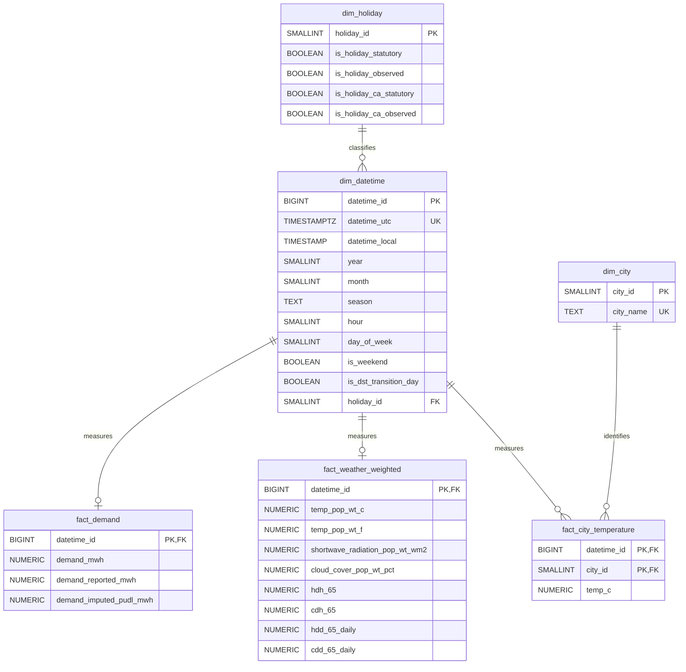

<!-- Created as fallback for Basel Tamer Fathy; merge/replace if his PR lands. -->

# Data warehouse entity relationships

```mermaid
erDiagram
    dim_holiday ||--o{ dim_datetime : classifies
    dim_datetime ||--o| fact_demand : measures
    dim_datetime ||--o| fact_weather_weighted : measures
    dim_datetime ||--o{ fact_city_temperature : measures
    dim_city ||--o{ fact_city_temperature : identifies

    dim_holiday {
        SMALLINT holiday_id PK
        BOOLEAN is_holiday_statutory
        BOOLEAN is_holiday_observed
        BOOLEAN is_holiday_ca_statutory
        BOOLEAN is_holiday_ca_observed
    }

    dim_datetime {
        BIGINT datetime_id PK
        TIMESTAMPTZ datetime_utc UK
        TIMESTAMP datetime_local
        SMALLINT year
        SMALLINT month
        TEXT season
        SMALLINT hour
        SMALLINT day_of_week
        BOOLEAN is_weekend
        BOOLEAN is_dst_transition_day
        SMALLINT holiday_id FK
    }

    dim_city {
        SMALLINT city_id PK
        TEXT city_name UK
    }

    fact_demand {
        BIGINT datetime_id PK, FK
        NUMERIC demand_mwh
        NUMERIC demand_reported_mwh
        NUMERIC demand_imputed_pudl_mwh
    }

    fact_weather_weighted {
        BIGINT datetime_id PK, FK
        NUMERIC temp_pop_wt_c
        NUMERIC temp_pop_wt_f
        NUMERIC shortwave_radiation_pop_wt_wm2
        NUMERIC cloud_cover_pop_wt_pct
        NUMERIC hdh_65
        NUMERIC cdh_65
        NUMERIC hdd_65_daily
        NUMERIC cdd_65_daily
    }

    fact_city_temperature {
        BIGINT datetime_id PK, FK
        SMALLINT city_id PK, FK
        NUMERIC temp_c
    }
```
